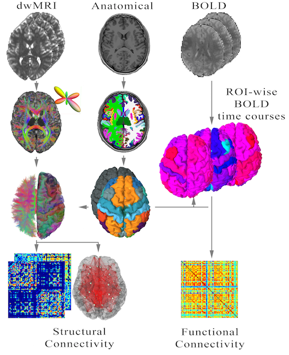

# TVB-Pypeline - - Work in Progress!

This project maps our current automatized MRI processing pipeline (http://github.com/BrainModes/TVB-empirical-data-pipeline)
to Python using Nipype, making the used toolboxes inside easily exchangeable.

For a general overview about the pipeline see [Schirner, Rothmeier et al. (2015)](http://www.sciencedirect.com/science/article/pii/S1053811915002505)



Please note that this pipeline does extensive analysis and is thus computationally heavy. TEsting was carried out on a High-Performance-Clustercomputer using >100 CPU Cores.

----------

## Installation:
The Pipeline uses Nipype which depends mainly on **Python 2.7**. The following list gives an overview about the Python toolboxes which are used in the current state of the Pipeline. See the corresponding Doc-Pages for installation and dependency resolving.
+ [Nipype](http://nipy.org/nipype/users/install.html)
+ [Nibabel](http://nipy.org/nibabel/installation.html#installation)
+ [Dipy](http://nipy.org/dipy/installation.html)

Since Nipype/Python also perform as a wrapper for Toolboxes invoked through the Shell-Interface, you also have to make sure the toolboxes you want to use are installed on your system and their binaries/libs are included in the Shell's searchpath.

For **preprocessing**, the following toolboxes are used:
+ [FSL](http://fsl.fmrib.ox.ac.uk/fsl/fslwiki/)
+ [FREESURFER](https://surfer.nmr.mgh.harvard.edu/fswiki/DownloadAndInstall)
+ [DICOM2NII](http://www.mccauslandcenter.sc.edu/mricro/mricron/dcm2nii.html)

When it comes to **fiber tractography**, there is a vast number of available tools for that. Their usage also highly depens on how your dwMRI-Data was recorded. One of the main parting points is the number of different diffusion-gradient strengths applied during the measurement (i.e. the number of different **b-values**). If the dataset has only a single value greater than zero, one talks about **single-shell data**. As soon as more than one value (>0) is involved, the data is called **multi-shell data**

Currently, we tested two toolboxes for tractography, one for each of the aforementioned scenarios:
 + [MRTrix 0.2.12](http://jdtournier.github.io/mrtrix-0.2/index.html): Single-Shell Tracking
 + [FSL](http://fsl.fmrib.ox.ac.uk/fsl/fslwiki/FDT): Multi-Shell Tracking (Not yet implemented in the Python-Pipeline!)


##### Install the Pipeline
Download the files from the GitHub Repository and unpack the files on your workstation/cluster.
To run it on a specific cluster architecture, simply edit the plugin-type in the master control script [TVB_pipeline.py](https://github.com/srothmei/TVB-Pypeline/blob/master/workflows/TVB_pipeline.py).
Locate the following code block at the end of the file
```python
# ## Run the Workflow
#wf.run(plugin='MultiProc', plugin_args={'n_procs': cpu_count()})
wf.run(plugin='OAR', plugin_args={'oarsub_args': '-l walltime=04:00:00'})
wf.run()
```
As you can see, plugins are used to handle different situations considering the environment in which the pipeline is intended to be run, e.g. different job schedulers on High-Performance-Clustercomputer or local installations on a multicore workstation.
For an overview about the available plugins see the [Doc-Page about Plugins](http://nipy.org/nipype/users/plugins.html). Since this page is sometimes a bit outdated (e.g. the OAR plugin is not yet listed), see also https://github.com/nipy/nipype/tree/master/nipype/pipeline/plugins

## Preparing your rawdata
The organization of the users raw-data is still a bit inflexible, considering the fact that currently the user needs to provide absolute paths to
the different imaging modalities. The pipeline currently support the following input formats for your raw-data:
+ DICOM
+ (compressed) NifTi

**Note that if you supply your diffusion data in NifTi format, the gradient information will not be passed along thus you have to provide those data seperately. See below for the paramters used at startup or refer to the --help string of the pipeline scripts itself.**

Your raw-data may be located anywhere on your system while the pipeline outputs can be stored in a different location specified by a parameter passed to the pipeline during startup. For example, a subject folder may look like the following:
```bash
/home/myUserName/pipeline/subjects/
|-- Sub1/
|   |-- RAWDATA/
|   |   |-- MPRAGE/
|   |   |   |-- Maybe/Some/SubFolders
|   |   |   |   |-- Arbitrary-Image-Names-001.dcm
|   |   |   |   |-- Arbitrary-Image-Names-002.dcm
|   |   |   |   |-- ...
|   |   |-- DTI/
|   |   |-- BOLD-EPI/
```
Inside the several folders for the different imaging modalities, the number of subfolder doesnt matter. But if you store a series of (DICOM) raw-images, it is crucial to not mix them inside the very same folder because the pipeline just scans for \*.dcm files

##### Using fMRI data is optional, i.e. if you don't pass that data into the pipeline at start, you still get the structural and dwMRI data processed!

## Running the Pipeline

To finally run the pipeline, locate the **TVB_pipeline.py** script using your systems Shell. The parameters need are explained in the following excerpt from the scripts own help-text. The file- and folder-paths refer to the aforementioned folder-structure.
```bash
python /home/myUser/pipeline/TVB_pipeline.tyb --help
+++ TVB Automated Processing Pipeline +++

    This script invokes the TVB automated processing Pipeline.
    Usage:  -s <SUBJECT-ID> -r <SUBJECT-DIR> -a <T1-DATA-DIR> -d <DIFFUSION-DATA-DIR>

    Obligatory inputs are:
        -s --sub-id <SUBJECT-ID>            :   The Identifier of the Subject
        -r --sub-dir <SUBJECT-DIR>          :   The absolute path to the folder where you want the results to be stored
        -a --structural-rawdata   :   Absolute path to your structural T1 anatomical data
        -d --diffusion-rawdata    :   Absolute path to your diffusion weighted MRI data

    Optional inputs are:
        -f --functional-rawdata   :   Absolute path to your functional MRI data (BOLD)
        --bval <FILE-PATH>                  :   Path to the bval file
        --bvec <FILE-PATH>                  :   Path to the bvec file
```

The log-files are stored into the **SUBJECT-DIR**.

## Example: Deploying & running on a Cluster using the OAR job sheduler
TODO!

## The Results of the Pipeline

Among several intermediate results, like a full **FREESURFER recon_all** dataset, there are also several datasets which are in-house developed. THe generation is described in the aformentioned research article. The following tables can bee seen as a reference linking the explanations in the paper to the file- and variable-names which are generated by the pipeline-code.

##### Diffusion-MRI:
The results are by default stored into **\<SUBJECT-DIR>/tractography/tracks/\<SUBJECT-ID>_SC.mat** (MATLAB/Octave file) and also in JSON format **\<SUBJECT-DIR>/tractography/tracks/\<SUBJECT-ID>_SC.json**
Those files include several matrices representing different metrics:

| Variable-Name | Type of Data | Refered to in the paper as |
| ------------- |:-------------:|:-------------:|
| SC_cap_agg_counts | Region-wise Capacity Matrix using the number of tracts found between different regions | Raw Counts |
|SC_cap_agg_bwflav1| Region-wise Capacity Matrix using the number of distinct connections found on single-voxel level | Distinct Connections |
|SC_cap_agg_bwflav1_norm|Same data as above but normalized to the range between 0 and 1|||
|SC_cap_agg_bwflav2| Region-wise Capacity Matrix using the number of distinct connections found on single-voxel level. Each strength entry is weighted by the total number of connections leaving the corresponding brain area | Weighted Distinct Connections |
|SC_cap_agg_bwflav2_norm|Same data as above but normalized to the range between 0 and 1|||
|SC_dist_\<mean/mode/median>_agg|The mean/mode/median distance between all distinct tracks connecting the individual brain regions|SC Distances|
|SC_dist_var_agg|The variance of the distance between all distinct tracks connecting the individual brain regions||

##### Functional-MRI:
By default, resulting data will be stored into ** \<SUBEJCT-DIR>/bold/**. Results feature a run of FSLs feat pipeline and also regionswise timeseries stored into the file ** \<SUBJECT-ID>_fMRI.mat **. As for the SC-file descbried above, this MATLAB/Octave file stores various things:

| Variable-Name | Type of Data |
| ------------- |:-------------:|
|ROI_ID_table|Various numbers from FREESURFERs **mri_segstat**. The headers have been removed. They can be found in the following file: **\<SUBEJCT-DIR>/bold/segstat_summary.txt**|
|\<SUBJECT-ID>_ROIts|A Matrix with dimensions fmri-timepoints X parcellation-regions. This matrix hold the region-wise averaged bold time course|
|FC_cc|The functional connectivity matrix. This matrix is computed by applying the corrcoeff function onto the parcellated bold timecourse, resulting in a matrix of dimensionality **number-of-brainregions X number-of-brainregions** |

Throughout our paper, we used the 68-Cortical-Regions of the Desikan-Killaney atlas. To reproduce the FC based on this atlas from the parcellated timeseries obtained by using the default parcellation in this pipeline (**aparc+aseg**), one can use the following code snippet:
```python
from numpy import shape
# Clear the ROI-table and leave only the Desikan entries
start1 = shape(ROI_ID_table)[0] - 69
stop1 = start1 + 34
start2 = stop1 + 1
stop2 = shape(ROI_ID_table)[0]
fMRI_DK68 = fMRI[:, range(start1, stop1)+range(start2, stop2)]
```

----------

## TODO-List:
+ ~~Write a new Documentation!~~
+ ~~Implement fMRI processing based on the code here: https://github.com/BrainModes/TVB-empirical-data-pipeline/blob/NSG/fmriFC.sh~~
+ Implement Tractography Thresholding into the MRTrix module. Possibly trying to include the method described in [Morris et al. (2008)](http://www.sciencedirect.com/science/article/pii/S1053811908007301). Alternatively one could also dig up the old hard-threshold code since the short-range tracking-flares are rendered meaningles anyway by our aggregation method!
+ Include some example workflows for different cluster scenarios, realized through e.g. controll-scripts written in BASH
+ Re-Implement Multishell-Tracking using FSLs bedpostx as in https://github.com/BrainModes/TVB-empirical-data-pipeline/tree/multiShell
+ Implement the formatting of the results into a TVB-ZIP-File as in https://github.com/BrainModes/TVB-empirical-data-pipeline/blob/NSG/matlab_scripts/connectivity2TVBFS.m
+ ~~Check if Non-DICOM data works as input~~
+ ~~Add a Doc-Section about the resulting data~~
+ Support multiple runs of fMRI (e.g. bold1; bold2; bold3; ...)
+ Integrate the possibility to include own parcellation masks in MNI space
+ Integrate Subcortical Tracking
+ ~~**If a single NifTi file is fed into dcm2nii, no bvec/bval file is computed thus they have to be fed in seperately! Implement this!**~~
+ Document example workflow for Marseille OAR cluster (including setup!)
+ Convert the pipeline into a Python package and install it into site-packages (like nipype). This should make the whole installation process far more easy and circumvent some problems when using a cluster!
+ Implement distortion correction using FSLs [EDDY](http://fsl.fmrib.ox.ac.uk/fsl/fslwiki/EDDY) is phase reversed recording is available
+ Sometimes there seem to be empty seed-masks...check for that!?
+ Check for the feat-config params (e.g. TA). They need to be estimated from the data!
